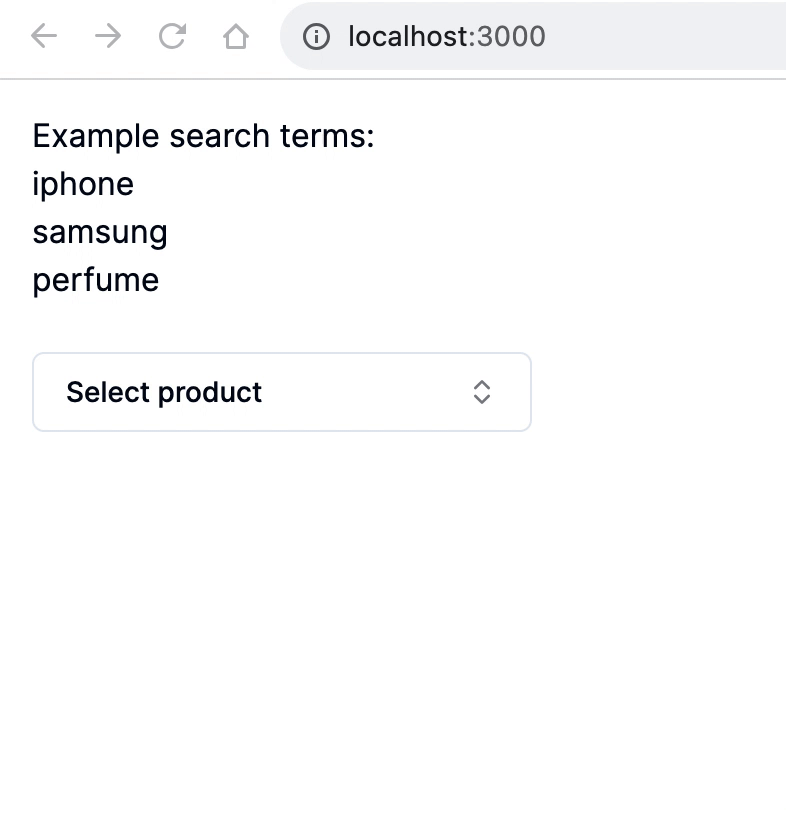

## Example async Combobox options



Small demo of a [shadcn/ui Combobox](https://ui.shadcn.com/docs/components/combobox) that has async items.

The `<Command />` component is [cmdk component](https://github.com/pacocoursey/cmdk/) by pacocoursey under the hood.

For this demo, it uses [dummyjson api](https://dummyjson.com) for simulating product data search, example query: `https://dummyjson.com/products/search?q=iphone`

Some key features/notes (specific for my usecase):

- Simulated delay for the API call (just to see loading/error/no results UI).
- Debounced search input so the API isn't hit on every keystroke.
- Hides the search results piece if there's no search query (I didn't want this constantly showing in the UI).
- Disables filtering and sorting on `<Command>` with `shouldFilter={false}`. The results from the API is the filter itself (no results from the API = no match for the search term).

## Run demo

```bash
yarn install
```

then

```bash
yarn dev
```
